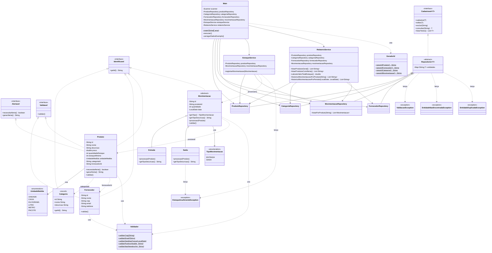

# Diagrama de Classes — Sistema de Controle de Estoque

## Legenda

| Símbolo | Significado |
|---------|-------------|
| `<\|--` | Herança / extensão |
| `<\|..` | Implementação de interface |
| `-->` | Associação / uso direto |
| `..>` | Dependência |

## Relações Principais

1. **Polimorfismo:** `EstoqueService` recebe `Movimentacao` e invoca `processar(Produto)` — resolvido em tempo de execução por `Entrada` ou `Saida`.
2. **Genéricos:** `Repositorio<T extends Identificavel>` implementa `Cadastravel<T>` com `HashMap<String, T>`.
3. **Alertas:** `RelatorioService` filtra produtos via `Alertavel::necessitaAlerta` sem conhecer detalhes de `Produto`.
4. **Validação:** entidades `Validavel` são validadas automaticamente no `Repositorio` antes de cadastrar/editar.
